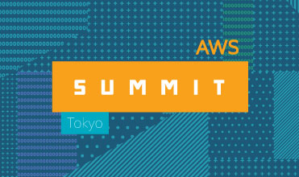

# aws summit tokyo201 7doc

## about aws

## about aws summit tokyo 2017

  
5 月 31 日 ～ 6 月 2 日  
グランドプリンスホテル新高輪  
国際館パミール、飛天  
〒108-8612　東京都港区高輪 3-13-1

品川プリンスホテル  
アネックスタワー 5F プリンスホール  
〒108-8612　東京都港区高輪 3-13-1  

昨年延べ 13,000名以上
## time table
### 5/31 

| 時間/トラック | AWS Techトラック 1 | AWS Techトラック 2 | AWS Techトラック 3 | 導入事例トラック 1 | 導入事例トラック 2 | 導入事例トラック 3 |
|---------------|---------------------------------------------------------------------------------------------------|-------------------------------------------------------------------------------------------------------|---------------------------------------------------------------------------------------------------|------------------------------------------------------------------------------------------------------------------------|----------------------------------------------------------------------------------------|--------------------------------------------------------------------------------------------------|
| 10:00〜11:30 | Day2 基調講演（キーノート） |  |  |  |  |  |
| 12:20〜13:00 | AWS Well-Architected フレームワークによるクラウド ベスト プラクティス | エンタープライズ・クラウドジャーニーの最新動向 | 教えて！中堅企業の事例に学ぶ AWS 活用サクセスストーリー | インテル様セッション |  | ナビタイムサービスにおける、Amazon ECS を活用したシステム移行　〜『乗換NAVITIME』での移行事例 〜 |
| 13:20〜14:00 | Going Serverless with AWS | 国内・国外の金融分野での AWS 活用 | Amazon EC2 入門 | [リコー] サービス全断はダメ、ゼッタイ。途切れないテレビ会議システムを目指して ?AWS を最大限活用して可用性を高める秘策? | [NEXCOシステムズ] 日本の高速道路を IT で支える会社がクラウド利用に踏み切る時 | [国際航業] ドローンを用いた3次元空間解析クラウドサービス |
| 14:20〜15:00 | Amazon Aurora for PostgreSQL アーキテクチャ・特長と移行 | 流通業界におけるデジタルトランスフォーメーションの実践 | AWS のストレージサービス入門 | ドコモが考える地道なデジタル化とその先にある AI | [KNT-CTホールディングス] オンプレ企業がクラウドファースト企業に変わるまで（仮） | [協和発酵キリン] シンクライアント環境を Amazon Workspaces に移行してわかったこと |
| 15:20〜16:00 | [アクセンチュア] 基幹系も含む全システムのクラウド化に向けた戦略と効果【実践編】 | [伊藤忠テクノソリューションズ] デジタルビジネスを加速するクラウド活用の本質 〜DevOps Transformation〜 | サーバとデータのマイグレーション ソリューション | NEC が進めるエンタープライズユーザ向けクラウド活用の実践 | ［サーバーワークス]クラウドで実現する「開発レスアーキテクチャ」 3 つの事? | レーベルゲート音楽配信プラットフォームと AWS Snowball を利用したデータ移行 |
| 16:20〜17:00 | よくある問題を解決する〜 5 分でそのままつかえるソリューション by AWS ソリューションズビルダチーム | デジタルトランスフォーメーションを加速する SAP HANA on AWS | AWS のネットワーク設計入門 | ゲオを支える DB 基盤の歴史と未来　〜Oracle から Amazon Aurora へ〜 | ［AGC 旭硝子］クラウドで変わる。インフラ・データセンター・組織のありかた（仮） | ローソンが考えるクラウド時代のシステム運用・監視の姿 〜システム監視からビジネス監視へ〜（仮） |
| 17:20〜18:00 | クラウドでアクセラレーテッドコンピューティング！GPU と FPGA を駆使してアプリケーションを高速化 | 具現化するエンジニアリングクラウド on AWS | Amazon RDS 入門 | KDDI 流 クラウド・セキュリティ 〜「大企業のクラウド適応」 秘伝のレシピ〜 | [日立物流] 周回遅れからのクラウド挑戦 - しがらみからの脱却 - | 横河電機のソフトウェア開発における AWS 活用事例 〜Ops から始める DevOps〜 |
| 18:20〜19:00 | データベースの近代化：シンプルなクロスプラットフォーム、最小のダウンタイムで実現するクラウド移行 | AWS のコスト最適化入門 | 未来へのつながり:史上初・宇宙からの 4K ライブストリーミングを実現させたテクノロジーとワークフロー | 【AWS Tech 再演】Amazon EC2 入門 | 【AWS Tech 再演】国内・国外の金融分野での AWS 活用（仮） |  |
| 19:20〜20:00 | 【AWS Tech 再演】Amazon RDS 入門 | 【AWS Tech 再演】AWS のストレージサービス入門 |  | 【AWS Tech 再演】AWS のネットワーク設計入門 | 【AWS Tech 再演】AWS Well-Architected フレームワークによるクラウド ベスト プラクティス |  |

| 時間/トラック | Dev Day トラック 1 | Dev Day トラック 2 |
|---------------|---------------------------------------------------------------------------------------------------------------------------------------------------|--------------------------------------------------------------------------------------------|
| 13:20〜14:00 | C# 開発者必見、Docker コンテナへの継続的デプロイメント on AWS 〜CodeCommit, CodeBuild, CodePipeline, CloudFormation, ECR, ECS を活用した CI/CD 〜 | ?マイクロサービスを設計する全ての開発者に送る?クラウド時代のマイクロサービス設計徹底解説！ |
| 14:20〜15:00 | AWS Mobile Deep Dive - 入門から実践までの最短コース ? ライブコーディングで学ぶ AWS を活用したモバイルアプリの開発 ? | [ABEJA] IoT / Bigdata / AI 時代におけるスケーラブルな Deep Learning 実行基盤と応用 |
| 15:20〜16:00 | ChatWork の新メッセージングシステムを支える技術 | [JapanTaxi] Athena 指向アナリティクス ?真面目に手を抜き価値を得よ? |
| 16:20〜17:00 | 【ライブ コーディングも実施】Amazon Pay の仕組みと実装方法 | Sansan がメッセージング (Amazon SQS) でスケーラビリティを手に入れた話: using C# on Windows |
| 17:20〜18:00 | Amazon ECS の進化、DevOps と Microservices の実践 | Gunosy における AWS 上での自然言語処理・機械学習の活用事例（仮） |

### 6/1
| 時間/トラック | AWS Techトラック 1 | AWS Techトラック 2 | AWS Techトラック 3 | 導入事例トラック 1 | 導入事例トラック 2 | 導入事例トラック 3 |
|---------------|---------------------------------------------------------------------------------|-----------------------------------------------------------------------------|---------------------------------------------------------|---------------------------------------------------------------------------------------|-------------------------------------------------------------------------------------------------------|---------------------------------------------------------------------------------------------------------------------------------------------------------------------------------------|
| 10:00〜11:30 | Day 3 基調講演（キーノート） | - | - | - | - | - |
| 12:20〜13:00 | AWS サポートと各種運用支援ツールを利用した、システム運用・管理やコストの最適化 | 最新 IoT デザインパターン　?AWS IoT と AWS Greengrass を用いた構築パターン? | AWS によるマイクロソフトアーキテクチャの最適化 | - | - | ERP のインフラ基盤から IoT サービス基盤としてサーバレス化の実現まで、JINS の AWS 活用 |
| 13:20〜14:00 | Speed matters - Amazon Kinesis が実現するストリーミングデータのリアルタイム分析 | Oracle Database から Aurora & Redshift に移行するための実践ガイド | AWS の Edge サービス入門 | [アダストリア] 「AWSデザインガイド」 策定に至った経緯とその後 | クックパッドの機械学習を支える基盤のつくりかた（仮） | [マツダ] CAE クラウドによる大規模サンプリングを活用した次世代の車両開発のための最適設計手法の検討 |
| 14:20〜15:00 | AWS Shield と AWS Lambda@Edge で構築するセキュアで柔軟性の高いアプリケーション | Architecting for the Cloud -クラウドにおけるアーキテクチャの設計原則 | AWS のコンテナ管理入門（Amazon EC2 Container Service） | PlayStation?Network のフレンド機能「Friendlist」の AWS 移行事例 | [朝日放送] サーバレスアーキテクチャで実現した M-1 グランプリ敗者復活戦投票システム | [集英社] 読書アプリクイックスタートガイド：AWSを活用したアプリ事業開発事例とデジタルコミックス制作フロー |
| 15:20〜16:00 | エンタープライズと IoT における日立の AWS 活用事例 | [トレンドマイクロ] AWS にフィットする最適なセキュリティ対策とその考え方 | AWS の NoSQL 入門 ?Amazon ElastiCache, Amazon DynamoDB? | 業種・業界を超えた AWS 活用事例とミッションクリティカルシステムへの挑戦 | [アイレット] 転換期を迎えるいま、『オンプレミスからのマイグレーション』における勝利の方程式とは | Amazon ECS と SpotFleet を活用した低コストでスケーラブルなジョブワーカーシステム |
| 16:20〜17:00 | Amazon Redshift テーブル設計詳細ガイド ?分散スタイルとソートキーの決定方法? | AWS で実現するセキュリティ・オートメーション | AWS でのストリーム処理入門 | グリーの様々なサービスを支えるクラウド運用およびデータ分析基盤 | セイコーエプソンのデータプラットフォームビジネスにおけるサーバレスアーキテクチャへのマイグレーション | [マクロミル] Amazon Aurora・AWS DMS を活用したデジタルマーケティングプラットフォーム構築〜マクロミルが独自開発したデータ分析システム（Web 行動データｘ 調査意識データ）の構築ノウハウ |
| 17:20〜18:00 | Amazon Aurora (MySQL-compatible edition) Deep Dive | Machine Learning on AWS | Amazon EC2 Systems Managerによるハイブリッド環境の管理 | 開発組織を急成長させる AWS ? Opt Technologies の歩みと AWS 活用 | [Intelligence] オンプレから移行するので、Amazon ECS でコンテナ化と Terraform でインフラコード化した話 | [はてな] 時系列データベースという概念をクラウドの技で再構築する |
| 18:20〜19:00 | 【AWS Tech 再演】AWS のコンテナ管理入門（Amazon EC2 Container Service） | 【AWS Tech 再演】Amazon EC2 Systems Manager によるハイブリッド環境の管理 | - | 【AWS Tech 再演】Architecting for the Cloud -クラウドにおけるアーキテクチャの設計原則 | 【AWS Tech 再演】AWS で実現するセキュリティ・オートメーション | - |
| 19:20〜20:00 | 【AWS Tech 再演】AWS の Edge サービス入門 | 【AWS Tech 再演】AWS の NoSQL 入門 ?Amazon ElastiCache, Amazon DynamoDB? | - | 【AWS Tech 再演】Machine Learning on AWS | 【AWS Tech 再演】最新 IoT デザインパターン　?AWS IoT と AWS Greengrass を用いた構築パターン? | - |

| 時間/トラック | Dev Day トラック 1 | Dev Day トラック 2 |
|---------------|----------------------------------------------------------------------------|---------------------------------------------------------------------------------------------------------------|
| 13:20〜14:00 | DevSecOps on AWS - Policy in Code | [スマートニュース] 大規模広告クリック率予測システムの実践 |
| 14:20〜15:00 | AWS Greengrass Deep Dive | [[CyberZ] OPENREC.tvにおけるライブ動画およびメッセージ配信基盤のリプレース全貌](http://engineer-blog.cyber-z.co.jp/entry/2017/06/07/210650) |
| 15:20〜16:00 | Blockchain on AWS -Ethereum Deep Dive with INFURA- | [[メルカリ] Cloud connect the world as a Glue](http://tech.mercari.com/entry/2017/06/05/110000) |
| 16:20〜17:00 | Deep Learning with Apache MXNet on AWS | [アプトポッド] リアルタイムな双方向ファストデータ伝送を実現する高速 IoT 基盤 - 開発・運用のこれまでとこれから |
| 17:20〜18:00 | Startup CTO Night with Amazon CTO 〜Werner Vogels による公開技術レビュー〜 |  |
| 18:30〜20:00 | - | Dev Day Night Powered by Intel |
### 6/2

| 時間/トラック | AWS Techトラック 1 | AWS Techトラック 2 | AWS Techトラック 3 | 導入事例トラック 1 | 導入事例トラック 2 | 導入事例トラック 3 |
|---------------|---------------------------------------------------------------------------------------------------------------------|---------------------------------------------------------------------|-----------------------------------------------------------------------|-------------------------------------------------------------------------------------------------------------|----------------------------------------------------------------------------------------------------------|---------------------------------------------------------------------------------------------------------------------------------------------|
| 10:00〜12:00 | Day 4 特別講演 |  |  |  |  |  |
| 12:20〜13:00 | AWS Cloud Adoption Framework で作成するクラウド導入ロードマップ | Amazon Redshift Ecosystem | Amazon AI 入門 | HERE: Making sense of the world through the lens of location. |  |  |
| 13:20〜14:00 | クラウドが変革するエンドユーザーコンピューティング | AWS におけるマルチアカウント管理の手法とベストプラクティス | AWS のデータ分析入門 | Amazon Innovation Dive Deep Session 1 - Increasing Monetization with Dash Replenishment Service (DRS) | ヤンマーが提案する『ロボットトラクタ』のご紹介 “A SUSTAINABLE FUTURE” の実現へ | [シーオス] 生産年齢人口減少を解決するスマートデジタルロジスティクスとそれを支える AWS の活用法 |
| 14:20〜15:00 | Amazon EC2 Innovation at Scale - 革新を続けるハイパースケール EC2 サービスの最新情報を EC2 サービス責任者がご紹介 | アジャイルデータサイエンス on AWS | AWS のビジネスアプリケーション入門（Amazon Chime, Amazon WorkSpaces） | Amazon Innovation Dive Deep Session 2 - Building Voice Skills with Amazon Alexa | [日本経済新聞社] "ＡＩ 記者"の生みの親〜「テクノロジーメディア」への挑戦 | DMM における会員基盤プラットフォームへのAWS導入から活用事例の紹介 |
| 15:20〜16:00 | [クラスメソッド] 1000 件超の構築・運用から得た、急成長ビジネスを支えるデータ分析基盤と AWS インフラ環境の事例（仮） | 事例から読み解く Salesforce と AWS の付加価値クラウドソリューション | AWS セキュリティ入門 | [富士ソフト] エンタープライズシステムも AWS で 〜IoT からデータセンター移行の課題と解決策〜 | ［TIS］ 金融業界でも使える！AWS 利用におけるガバナンスの効かせ方 | [PKSHA Technology] 動画像解析エンジン Vertical Vision API と、高速データ解析基盤（仮） |
| 16:20〜17:00 | AWS セキュリティ・コンプライアンス ?大規模環境におけるセキュリティの自動化と管理- | Amazon EC2 Performance Deep Dive | AWS の運用監視入門 (AWS CloudWatch) | Amazon Innovation Dive Deep Session 3 - Engineering for Performance in an Amazon Robotic Fulfillment Center | [ソニーモバイルコミュニケーションズ] スマートホームシステムの開発 ?AWS を活用した新規サービスの立ち上げ? | [ウィルポート] 宅配事業における再配達問題を解決する、地域密着型の小規模物流デポの展開と、IOT 通信を活用した次世代型無電源宅配ボックスの活用 |
| 17:20〜18:00 | AWS 環境での CSIRT ソリューション | AWS マネージドサービスで実現する CI/CD パイプライン | AWS のガバナンス入門 (AWS CloudTrail, AWS Config) | AWS と Amazon Launchpad で加速するスタートアップの事業成長とは。最新事例から | [ダイドードリンコ] 自販機 IoT 実現に向けた DyDo の取り組み | [グリッド] 分散並列による Deep Neural Network の最適化?ディストリビューテッドパラメータ探索 |
| 18:30〜20:00 | JAWS-UG Night in AWS Summit Tokyo 2017 |  |  |  |  |  |

| 時間/トラック | Dev Day トラック 1 | Dev Day トラック 2 |
|---------------|----------------------------------------------------------------|-------------------------------------------------------------------------------------------------------------------------|
| 13:20〜14:00 | 全部教えます！サーバレスアプリのアンチパターンとチューニング | [JINS] バイタルデータの意味付けという荒波を乗り越える！適切な処理分担のためのサーバーレスアーキテクチャー |
| 14:20〜15:00 | サーバレスで王道 Web フレームワークを使う方法 | [ワイヤ・アンド・ワイヤレス] AWS Lambda を使ったモバイルバックエンドのサーバレス開発事例 |
| 15:20〜16:00 | [タワーズ・クエスト]Serverless 時代のテスト戦略（仮） | [ワークスアプリケーションズ] AWS Lambda で変わるバッチの世界 ~ CPU 時間トータル 100 時間の処理を 10 分で終わらせるには~ |
| 16:20〜17:00 | もう悩まない！AWS SAM で始めるサーバーレスアプリケーション開発 | [Sansan] AWS が支える Eight のリコメンデーションエンジンの裏側 |
| 17:20〜18:00 | サーバーレスアプリケーションのための CI/CD パイプライン構築 | [日本経済新聞社] 紙面ビューアーとサーバーレスアーキテクチャ |
| 18:30〜20:00 | - | Dev Day Night Powered by Intel |

### game tech

| title  |
|-------|
| **[「『黒騎士と白の魔王』の gRPC による HTTP/2 API/ストリーミング通信の実践」](https://www.slideshare.net/neuecc/grpchttp2-api-streaming)** |
| 4 月にリリースした「黒騎士と白の魔王」では、iOS/Android のモバイルアプリケーションからの全ての通信を gRPC による HTTP/2 で行っています。API リクエストからストリーミングまで、gRPC のあらゆる機能を使って実現した「黒騎士と白の魔王」のアーキテクチャについて、AWS 上でのスケーリングやデプロイを考慮した構成も含めてご紹介します。  株式会社グラニ取締役 CTO河合 宜文様                                                                                                    |
| **「Cloud Gem/Amazonゲームエンジン Lumberyard Use case study」** |
| ランバーヤード エンジンの の中の一つの機能である Lumberyard Cloud Gems Framework によって、動的コンテンツ、リーダーボード、ライブメッセージなどの人気の高いクラウドコネクティッド機能を容易に構築できます。今回は Cloud Gem 開発の責任者である Felix Duchesneau より Cloud Gem に特化したプレゼンをさせていただきます。また、ランバーヤードの使用事例として弊社スタジオのエンジニアから、実際にランバーヤードを使って開発している事例をご紹介します。  Amazon Game Services |
| **「Super Mario Run を支える技術 〜ゲームサーバーインフラの舞台裏〜」**|
| 世界に配信される Super Mario Run を支えるシステムはいかに開発・運用されているのか？ 任天堂・DeNA の技術者が解説します。  任天堂株式会社 ビジネス開発本部 スマートデバイス事業部 事業システム開発グループ グループチーフ竹本 賢一様 株式会社ディー・エヌ・エー システム本部 IT基盤部 第二グループ グループマネージャー金子 俊一様                                                                                                                                               |
| **「カプコンにおけるインフラへの取り組み」** |
| OSS ミドルウェアを Amazon EC2 に載せる IaaS 利用が主であったこれまでの構成から AWS Lambda / Amazon DynamoDB / Amazon Aurora / Amazon GameLift / Amazon ECS といったマネージドサービスを活用した構成にした経緯を事例を交えてお話します。  株式会社カプコンモバイル開発室 副室長井上 真一様|
| **「累計 800 万ダウンロード『Fate/Grand Order』** |
| を支える技術」累計 800 万ダウンロードを達成しました 『Fate/Grand Order』における国内の改善事例と海外展開において、AWS のアーキテクチャをどのように利用してきたのかを実例を交えてお伝えします。  ディライトワークス株式会社上野 威史様 甲 英明様 田村 祐樹様                                                                                                                                                                                                                   |
| **「DAU 100 万人突破！ 急成長を支える Shadowverse のインフラ技術」**|
| Shadowverse はリリースから1年未満で DAU 100 万を達成しました。その急成長を支えたインフラ技術と大規模サービスの運用方法をお伝えします。セッションの中では、大量の対戦数を実現するため Nginx を使った L7 ロードバランサの開発秘話や、ビッグデータ解析のため自社開発のログ転送エージェントと AWS Lambda, Amazon ECS, Amazon S3 を組み合わせたログ収集システムについて紹介いたします。  株式会社Cygamesエンジニアマネージャー佐藤 太志様                                        |
### cloud vs on-premise

## slides

